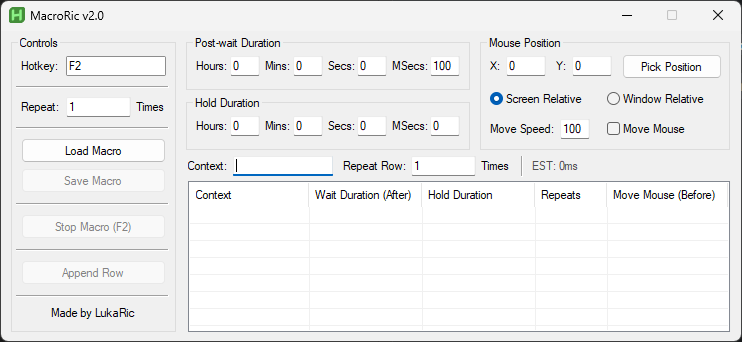

# MacroRic

**MacroRic** is an AutoHotkey-based macro automation tool that allows you to create, save, and execute custom macros with mouse movement, keyboard input, and timing. It provides a GUI for control, configuration, and execution of macros.

---

### MacroRic UI

---

## Features

- Create macros with:
  - Keyboard input sequences
  - Mouse movement (screen or window relative)
  - Custom wait and hold durations
- Repeat macros and individual macro rows multiple times
- Save and load macros in `.mrs` format
- Hotkey support for starting/stopping macros
- GUI with an interactive list view for managing macro rows
- Estimated execution time calculation

> The application will automatically create the required folders and configuration files in your `%AppData%` directory: